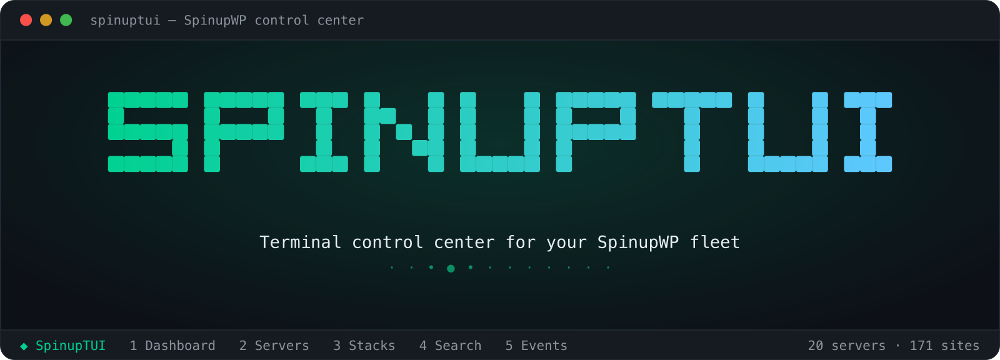

<p align="center">
  
</p>

<h1 align="center">SpinupWP TUI</h1>

<p align="center">
  A fast, keyboard-driven terminal dashboard for browsing and monitoring your
  <a href="https://spinupwp.com">SpinupWP</a> servers and sites.<br>
  Built with <a href="https://opentui.com">OpenTUI</a> and <a href="https://bun.sh">Bun</a>.
</p>

Once you're in, the dashboard looks like this:

```
 ◆ SpinupWP   1 Dashboard   2 Servers   3 Stacks   4 Search   5 Events   20 servers · 171 sites

 ┌──────────────┐ ┌───────────────┐ ┌───────────────────┐ ┌──────────────────────┐
 │ Servers      │ │ Sites         │ │ Fleet Disk        │ │ WP Updates           │
 │ 20           │ │ 171           │ │ 22%               │ │ 359                  │
 │ 20 connected │ │ 139 WordPress │ │ 616.3 GB / 2.8 TB │ │ 217 plugin · 67 core │
 └──────────────┘ └───────────────┘ └───────────────────┘ └──────────────────────┘
 ┌─ Disk usage by server ───────────────┐ ┌─ Needs attention (27) ──────────────┐
 │ web1.example.com       ██████░░░ 60% │ │ • db1.example.com — …               │
 │ web2.example.com       ██████░░░ 57% │ │ • web3.example.org — OS …           │
 └──────────────────────────────────────┘ └─────────────────────────────────────┘
```

## Features

- **Fleet dashboard** — at-a-glance health of every server: connection status,
  disk usage bars, pending reboots/OS upgrades, WordPress update counts, and a
  recent activity feed.
- **Server & site browser** — a three-pane navigator. Pick a server, see its
  sites, drill into full details (PHP version, HTTPS, page cache, backups, Git
  deployment, WP updates, and more).
- **Stack detection & fleet composition** — the Stacks tab classifies every site
  as Standard WP, Bedrock, or Non-WP, with a fleet-wide PHP version breakdown
  (EOL versions flagged). Press `d` to SSH-probe a site's actual stack — naming
  WHMCS, Laravel, Static HTML, and WordPress versions the API can't tell you —
  or `D` to probe a whole stack at once. (See "Stack detection" below.)
- **Global search** — fuzzy search across every server and site at once by name,
  domain, or IP. Tab onto a result to act on it (open, SpinupWP, PHP upgrade,
  health) right from the results, without leaving the search.
- **Events feed** — recent provisioning and operation activity, with per-event
  detail and output.
- **Live server health** — press `h` on any server for a real-time view over
  SSH: CPU (aggregate + per-core + sparkline), load, memory/swap, disk mounts,
  and top processes. Polls every few seconds. (See "Server health" below.)
- **Open in browser** — press `o` on any site to open it in your default browser.
- **Link local working copies** — press `L` on a site to link its local checkout
  (a path plus the local URL where you serve it), then open it with `t` (a
  terminal there) or `v` (its local URL). The Stacks tab can **auto-discover**
  copies (`S`) by git remote / Bedrock `WP_HOME` / folder name, and **report**
  managed sites that still need one (`f`). Linked sites show a `◆` marker, and a
  linked checkout shows its local git drift (`⇡N unpushed` / `● uncommitted`).
  (See "Local working copies" below.)
- **SSH into a site** — press `s` on a site to open a new terminal already running
  `ssh` into it (`{site_user}@{server_ip}`).
- **DNS migration lens** — press `n` on a site (or `N` on a server) to see the DNS
  records that move a site to another server: each site's hostnames with their type,
  TTL (in seconds), and a `◀ here` flag when they point at this server. Connect a
  provider (AWS Route 53 / Cloudflare) and press `⏎` to **edit a record's TTL** — the
  prep step for a low-risk cutover. It only ever touches a site's own hosting records,
  never your MX/TXT/other records. (See "DNS hosts, access & editing" below.)
- **Upgrade a site's PHP version** — press `u` on a site to pick a new PHP
  version and apply it (`PUT /sites/{id}/php`), then watch the upgrade event run
  to completion. (See "Upgrading PHP" below.)
- **Server actions** — press `a` on a server to reboot it or restart a service
  (Nginx / PHP-FPM / MySQL / Redis). Servers needing a reboot show a `↻rbt`
  badge, and the overlay reads the box over SSH to show *why* (the pending
  kernel/security packages). (See "Server actions" below.)

> The tool is **read-only by default** and works great with a Read Only API
> token. The write actions — upgrading a site's PHP version and rebooting /
> restarting services — need a **Read/Write** token; everything else keeps
> working without one.

## Requirements

- [Bun](https://bun.sh) ≥ 1.3 (OpenTUI uses Bun's native FFI). Install with:
  ```sh
  curl -fsSL https://bun.sh/install | bash
  ```
- A SpinupWP API token — create one at
  [spinupwp.app/account/api](https://spinupwp.app/account/api/). **Read Only**
  scope is enough to browse; use **Read/Write** if you want to upgrade a site's
  PHP version.

## Install & run

```sh
git clone <this-repo> spinupwp-tui
cd spinupwp-tui
bun install
bun run start
```

On first launch, if no token is configured you'll be guided through a short
onboarding flow that validates your token and saves it locally.

### Run `spinup` from anywhere

Install the `spinup` command globally with a symlink to this checkout (updates as
you pull):

```sh
bun run link-global      # = bun link; creates `spinup` on your PATH
spinup login             # save your API token to the config file (once)
spinup                   # launch from any directory
```

`spinup login` is what makes it work outside the project: the project `.env` is
only read from the project directory, so the global command relies on the token
saved in the config file. (Run `bun run unlink-global` to remove the command.)

For a standalone binary that doesn't need Bun on `PATH` at runtime:

```sh
bun run build:binary     # produces ./spinup — move it onto your PATH
```

#### CLI subcommands

```
spinup            Launch the dashboard
spinup login      Set or update your saved API token
spinup where      Show the config path and which source the token came from
spinup --version  Print the version
spinup --help     Show help
```

## Configuration

The token is resolved in this order (first match wins):

1. **`SPINUPWP_ACCESS_TOKEN`** environment variable. Bun automatically loads a
   `.env` file from the working directory, so a project-local `.env` works:
   ```sh
   # .env
   SPINUPWP_ACCESS_TOKEN=your-token-here
   ```
2. **`~/.config/spinupwp-tui/config.json`** — written by the onboarding wizard.
   Respects `XDG_CONFIG_HOME`.

To reconfigure, delete the config file (the path is shown on the onboarding
screen) and relaunch, or set the environment variable.

### Optional settings

Both can be set in `config.json` or via an environment variable:

- **`accountSlug`** / `SPINUPWP_ACCOUNT_SLUG` — your SpinupWP account/team slug
  (the first path segment in a SpinupWP URL, e.g. `wenmark-digital-solutions` in
  `https://spinupwp.app/wenmark-digital-solutions/servers/35633`). The API
  doesn't expose it, so set it to enable the `w` deep links into the web app.
  Without it, `w` opens the SpinupWP dashboard root.
- **`sshUser`** / `SPINUPWP_SSH_USER` — override the SSH user for the health view
  and stack probes (see "Server health" below).

## Keybindings

| Key | Action |
| --- | --- |
| `1`…`5` | Switch tabs: Dashboard · Servers · Stacks · Search · Events |
| `↑`/`↓` or `j`/`k` | Move selection |
| `Enter` / `→` | Drill in (server → its sites) |
| `←` / `Esc` | Go back / collapse |
| `Tab` | Switch focus between columns |
| `g` / `G` | Jump to top / bottom |
| `o` | Open the selected site in your browser |
| `s` | Open a terminal and SSH into the selected site |
| `L` | Link / edit a site's local working copy |
| `t` / `v` | Open the linked copy in a terminal / its local URL in your browser |
| `n` | DNS migration view for a site — its records + TTLs (`⏎` edits a TTL; `a` shows the whole server) |
| `N` | DNS migration view for the whole server |
| `h` | Live server health (CPU/mem/disk over SSH) |
| `d` | Detect a site's stack via SSH (Servers / Stacks tabs) |
| `D` | Detect every site in the selected stack (Stacks tab) |
| `S` | Auto-discover & batch-link local copies (Stacks tab) |
| `f` | Report sites with no usable local copy (Stacks tab) |
| `u` | Upgrade a site's PHP version (Servers / Stacks / Search; needs a Read/Write token) |
| `a` | Server actions: reboot / restart a service (Servers / Search; needs a Read/Write token) |
| `w` | Open the selected server/site in the SpinupWP web app |
| `/` | Jump to global search |
| `r` | Refresh data from the API |
| `i` | Explain the current screen (what each pane and key does) |
| `?` | Toggle the help overlay |
| `q` / `Ctrl+C` | Quit |

In the **Search** tab the box keeps keyboard focus while you type. Press **Tab**
(or **→**) to hand focus to the selected result's **action menu** — `o` / `w` /
`u` / `h` then act on that server or site — and **←** / **Esc** to return to the
search box.

## Server health (SSH)

The SpinupWP API exposes no live metrics, so the health view (`h` in the
Servers tab) reaches the server directly over SSH using **your local SSH keys /
agent** — the same way you'd `ssh in` and run `htop`. It runs a single batched,
**read-only** command (`cat /proc/*`, `df`, `ps`) and renders the result.

- **Connection target** is derived from the API: it connects as one of the
  server's `site_user`s at the server's IP (`site_user@ip`). No extra config
  needed if `ssh site_user@ip` already works from your terminal.
- **Non-interactive:** it uses `BatchMode=yes`, so if key auth isn't already set
  up it fails fast with a hint rather than prompting for a password.
- **Override the SSH user** (e.g. to use `root` or a sudo user) with the
  `SPINUPWP_SSH_USER` environment variable, or `"sshUser"` in the config file.
- A persistent `ControlMaster` connection keeps repeated polls fast.

Nothing is ever written to the server.

## Stack detection

The **Stacks** tab (`3`) breaks your fleet into buckets and helps you see what's
actually running where. It works in two tiers:

- **Tier 1 — instant, no SSH.** Every site is classified from data the API
  already returns: **Non-WP**, **Bedrock** (WordPress with a `/web/` webroot), or
  **Standard WP**. The left pane shows counts and bars; the right pane shows the
  fleet-wide **PHP version distribution** with end-of-life versions flagged.

- **Tier 2 — on-demand SSH probe.** Press `d` on a site (in the Stacks or
  Servers tab) to inspect its filesystem **read-only** and identify it precisely:
  **WordPress** (with version), **Bedrock**, **WHMCS**, **Laravel**, or
  **Static HTML**. Press `D` to probe an entire stack in list order (bounded SSH
  concurrency). A conclusive probe **overrides** the Tier-1 guess — so a site the
  API mislabels (e.g. WordPress installed outside SpinupWP's installer reports
  `is_wordpress=false`) moves into its true bucket. The Non-WP bucket expands
  into named sub-rows (WHMCS / Laravel / Static HTML / Unknown / unprobed).

Probes reuse the same SSH access as the health view (`site_user@ip`, your local
keys, `BatchMode`) and are **read-only**. Results are cached to
`~/.config/spinupwp-tui/stack-cache.json`, hydrated at startup, so detections
survive restarts without re-running SSH.

## Upgrading PHP

Press `u` on a selected site (in the **Servers** or **Stacks** tab) to change its
PHP version. A picker lists the available versions — the current one is marked,
end-of-life versions are flagged, and the list is sourced from the live PHP
release schedule (so new versions like 8.5 appear automatically). After you
confirm, the app calls `PUT /sites/{id}/php` and polls the resulting event until
it finishes.

- **Needs a Read/Write token.** SpinupWP exposes no token-scope endpoint, so a
  read-only token is detected when the upgrade comes back `403` — you'll get a
  clear "token is read-only" message and nothing changes. Swap in a Read/Write
  token (`spinup login`) to actually apply upgrades.
- **On-demand install.** If the chosen version isn't installed on the server yet,
  SpinupWP installs it first; the event simply takes a little longer.
- **Pending platform upgrade.** If the site's server has a pending SpinupWP
  platform upgrade, it can't be managed via the API until that runs — the picker
  is blocked and points you to open the server in the web app (`w`).
- **Runs in the background.** The upgrade is tracked in the app's store, so you
  can press `Esc` to close the modal and it keeps going — the site's row shows a
  spinner and the target version (`→8.3`) until it settles, then refreshes to the
  new version (or flags `⬆!` if it failed). The SiteDetail "PHP" field shows the
  same in-progress state. You can launch upgrades on several sites at once.

## Server actions

Press `a` on a selected server (in the **Servers** tab, or a result in **Search**)
to open the server-actions overlay: **reboot** the server, or **restart** a single
service (Nginx / PHP-FPM / MySQL / Redis). Pick → confirm → the app calls
`POST /servers/{id}/reboot` or `/services/{svc}/restart` and tracks the event to
completion — same background behavior as PHP upgrades (close the overlay and the
server's row keeps a spinner).

- **Needs a Read/Write token** (like PHP upgrades).
- **Reboot visibility.** Servers with a pending reboot show a `↻rbt` badge in the
  Servers list and on the Dashboard's "Needs attention" panel.
- **Why a reboot is pending.** The API only exposes a `reboot_required` boolean —
  no reason. So when you open the overlay on a flagged server, the app reads
  Ubuntu's `/var/run/reboot-required` + `.pkgs` over SSH (read-only, reusing the
  health view's connection) and shows the pending packages — typically a
  **kernel/security update**. This is labeled as OS-level context, not as
  SpinupWP's internal logic (a fleet-wide check confirmed the boolean tracks that
  file 1:1).
- **Reboot is the big one** — its confirmation calls out that it takes the whole
  server down briefly (every site on it); a service restart is a brief blip.

## Local working copies

Bridge your SpinupWP sites to the local checkouts you actually edit. Press `L` on
a site (Servers / Stacks / Search) to link a path and the local URL where you
serve it; the site's details gain a "Local" field, and you can open the copy with
`t` (a terminal at the path) or `v` (its local URL). All of this is **local-only**
— no SpinupWP writes.

- **Auto-discover (`S`, Stacks tab).** Scan one or more folders and match their
  subdirectories to sites — by git remote, Bedrock `WP_HOME`, or folder name —
  then batch-link the matches.
- **"Needs a local copy" report (`f`, Stacks tab).** Lists the managed sites you
  have no usable local copy for (never linked, or a missing path), filterable by
  stack.
- **Markers & drift.** Linked sites show `◆` in the lists; a linked, on-disk copy
  shows its local git drift (`⇡N unpushed` / `● uncommitted`), read from the repo
  with no network.

Config keys: `localRoots` (folders to scan) and `localSites` (per-site path +
local URL — tool-agnostic: Valet, Cove, LocalWP, Herd, DDEV, …).

## DNS hosts, access & editing

A **server-migration lens** for DNS: see the records that move a site to another
server, and edit them in place. It is deliberately **not** a full zone editor — it
only ever shows and touches a site's own hosting records (its apex / `www` /
subdomains and additional domains), so your MX, TXT, DKIM, and other zone records are
never shown or changed. Moving a site can't take down its email.

- **The view.** Press `n` on a site for just that site's records, or `N` on a server
  for every site on it; inside a site-scoped view, `a` expands to the whole server.
  Each **site** is a line, labeled by its own domain (even when it's a subdomain),
  with its hosting record's type, **TTL in seconds**, value, a `◀ here` flag when the
  record points at this server, and a `+www` tag when `www` simply follows the apex.
  A site's additional domains nest beneath it, so a domain portfolio reads as one
  site, not many. TTLs come from the zone's authoritative nameserver (the configured
  value, not a counted-down one), so they show even for hosts you haven't connected;
  `r` refreshes.
- **Access (`✓ ↗ ○ ·`).** Each record's zone shows whether you can edit it: `✓`
  editable, `↗` web-only handoff, `○` the provider has an API but you haven't
  connected an account that holds the zone, `·` unknown. A zone is `✓` only when a
  connected account of the provider that actually serves it (its live nameservers)
  holds it — so a stale or duplicate zone elsewhere never shows a false green. With
  two or more accounts connected, an **ACCOUNT** column names the owning one.
- **Edit a TTL (`⏎`).** On an editable record, `⏎` opens a focused editor — pick a
  preset or a custom value, confirm, and it's written to **AWS Route 53** or
  **Cloudflare** through your connected account. This is the prep step for a low-risk
  migration: lower the TTL, cut over, then restore it. Before writing, an edit-time
  check re-reads the live nameservers and **blocks** the change if the connected
  account's zone isn't the one actually serving the domain. Route 53 changes are
  followed to completion; the record shows an "updating" status that keeps ticking
  even if you leave the view. Only the **TTL** is editable for now (repointing a
  record's target comes later), and Cloudflare **proxied** records are read-only.
- **Connect a provider (`c`).** Manage credentials for the selected zone's
  provider — **AWS Route 53** (an IAM access key), **Cloudflare** (a scoped token),
  or **GoDaddy** (a Production API key). Multiple accounts per provider are
  supported, with a drill-down into each account's zones. Credentials are verified
  before they're stored, kept in `config.json` (chmod 600), and the matching
  environment variables are honored (`CLOUDFLARE_API_TOKEN`, `AWS_ACCESS_KEY_ID` /
  `AWS_SECRET_ACCESS_KEY`, `GODADDY_API_KEY` / `GODADDY_API_SECRET`). Secrets are
  masked as you type. Listing hosts needs only read access (Cloudflare `Zone:Read`);
  **editing a TTL** needs write access — Route 53 record writes, or a Cloudflare
  `Zone.DNS:Edit` token.
- **GoDaddy fallback.** GoDaddy's API is limited to larger accounts, so a GoDaddy
  zone shows `↗`; press `w` (in the inventory or the connect overlay) to open your
  GoDaddy Clients hub with the domain copied to your clipboard. The flow assumes
  you manage client domains via Delegate Access from one main account.

Provider credentials are optional — without them you still get the full host
inventory and TTLs, just without the editable/account columns or in-place editing.

## Development

```sh
bun run dev          # run from source
bun run typecheck    # tsc --noEmit
```

### Project layout

```
src/
  index.tsx          entry — boots OpenTUI, routes onboarding vs app
  config.ts          token resolution + persistence
  api/
    client.ts        typed fetch client (reads + writes, errors, validation)
    types.ts         Server / Site / Event types
  lib/               formatting, theme, open-in-browser, SSH helpers
    stack.ts         Tier-1 stack classification + effective (probe-aware) bucket
    probe.ts         Tier-2 SSH stack probe (WHMCS / Bedrock / Laravel / WP / …)
    stackCache.ts    disk-backed probe cache (hydrate on start, write-through)
    phpEol.ts        PHP EOL dates + the version set offered by the upgrade picker
  ui/
    App.tsx          shell: splash gating, key routing, layout
    store.tsx        React-context data store
    Splash / Onboarding / Header / StatusBar / Help
    List.tsx         generic windowed keyboard list
    Details.tsx      shared server/site detail panels
    views/           Dashboard, Browser, Stacks, Search, Events, Health, PhpUpgrade
```

## License

MIT — see [LICENSE](LICENSE).
