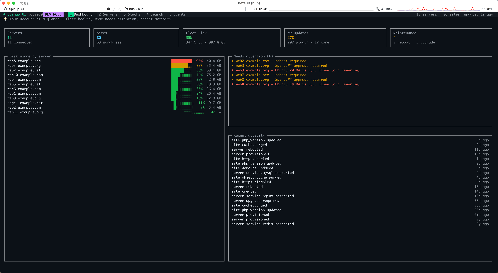
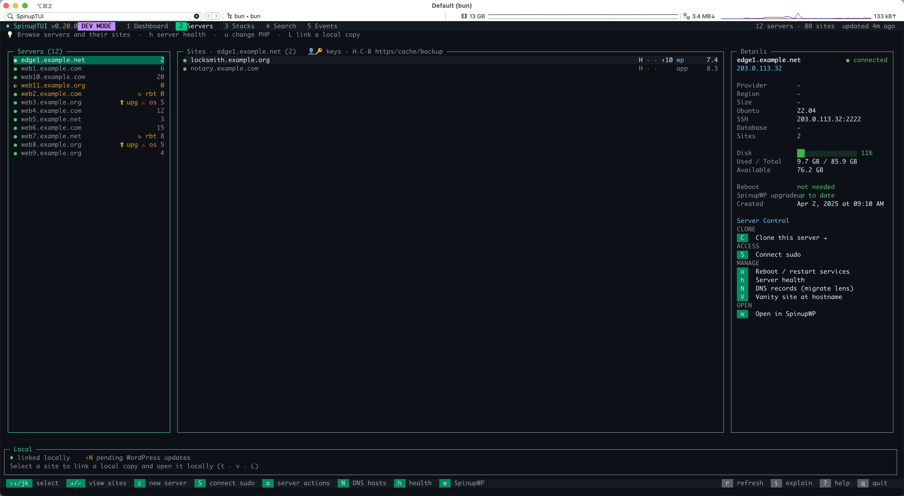
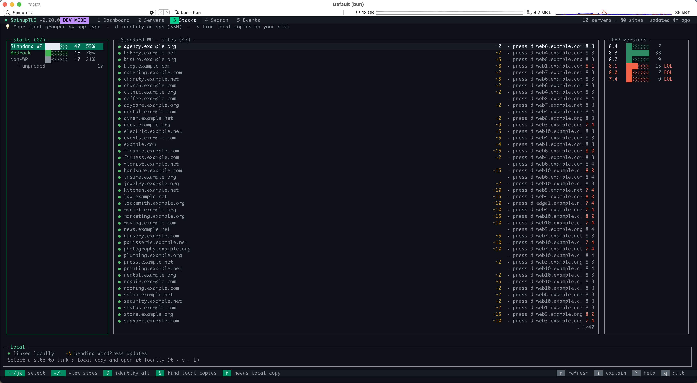
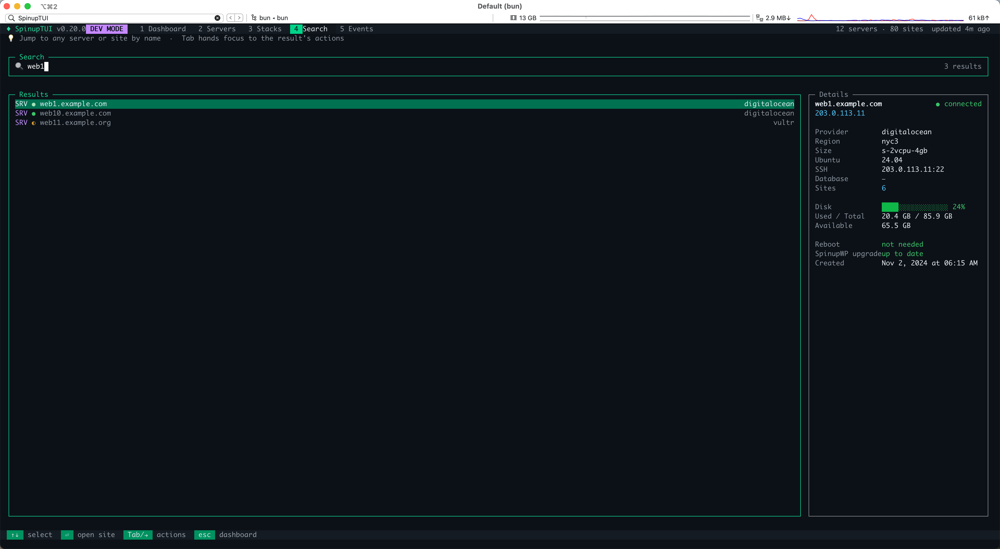
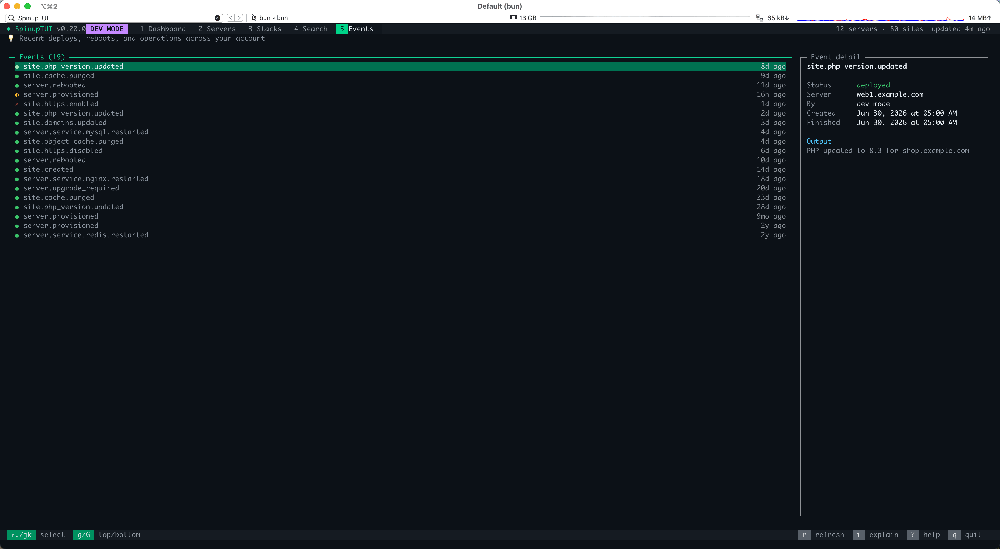

<p align="center">
  
</p>

<h1 align="center">SpinupTUI</h1>

<p align="center">
  A fast, keyboard-driven terminal control center for your
  <a href="https://spinupwp.com">SpinupWP</a> account — browse and monitor your
  servers and sites, and run local-dev workflows against them.<br>
  Built with <a href="https://opentui.com">OpenTUI</a> and <a href="https://bun.sh">Bun</a>.
</p>

## Screenshots

<p align="center">
  
</p>
<p align="center">
  
  
</p>
<p align="center">
  
  
</p>

## Features

- **Fleet dashboard** — connection status, disk usage, pending reboots/upgrades,
  WP update counts, EOL Ubuntu flags, and a recent-activity feed for every server.
- **Server & site browser** — a three-pane navigator (servers → sites →
  details) with a full-width Control strip below showing every action for
  whatever's selected — Site Control or Server Control, grouped and always
  visible, no hidden key combos.
- **Stack detection & fleet composition** — classifies every site as Standard WP,
  Bedrock, or Non-WP, with a PHP-version breakdown and an on-demand SSH probe for
  precise identification. → [docs/stack-detection.md](docs/stack-detection.md)
- **Global search** — fuzzy search across every server and site by name, domain,
  or IP, with inline actions on the result.
- **Events feed** — recent provisioning/operation activity with per-event detail.
- **Live server health** (`h`) — real-time CPU/load/memory/disk over SSH.
  → [docs/server-health.md](docs/server-health.md)
- **Installed plugins & themes** (`p`) — real `wp plugin`/`theme list` over SSH,
  with per-item version and update status. → [docs/plugins-themes.md](docs/plugins-themes.md)
- **Open in browser** (`o`) / **SSH into a site** (`s`) — one-key shortcuts.
- **Link local working copies** (`L`) — link a site to its local checkout, with
  auto-discovery and git-drift indicators. → [docs/local-working-copies.md](docs/local-working-copies.md)
- **DNS migration lens** (`n` / `N`) — see and edit a site's hosting records,
  repoint it to another server. → [docs/dns-access-editing.md](docs/dns-access-editing.md)
- **Database backup & sync** (`d` / `p`, Search tab) — download or pull a
  production DB into a linked local copy. → [docs/database-backup-sync.md](docs/database-backup-sync.md)
- **Production media fallback** (`m`, Search tab) — serve missing-locally images
  from production after a DB pull. → [docs/production-media-fallback.md](docs/production-media-fallback.md)
- **Upgrade a site's PHP version** (`u`) — pick a version, apply it, watch the
  event complete. → [docs/php-upgrade.md](docs/php-upgrade.md)
- **Enable / disable HTTPS** (`H`) — toggle a site's certificate.
- **Purge cache** (`P`) — clear page + object cache together.
- **Server actions** (`a`) — reboot or restart a service, with the real reason a
  reboot is pending. → [docs/server-actions.md](docs/server-actions.md)
- **Swap memory** (`a` → Manage swap) — inspect and safely create/enable swap
  directly over SSH; needs a connected sudo session. → [docs/swap-memory.md](docs/swap-memory.md)
- **Create & connect a server** (`c` / `V`) — provision a server, then wire it up
  end-to-end (DNS, a vanity site, HTTPS, SSH-key handoff).
  → [docs/creating-connecting-servers.md](docs/creating-connecting-servers.md)
- **Clone a whole server to a new one** (`C`) — a guided wizard that plans,
  copies, verifies, and cuts over DNS on your word.
  → [docs/cloning-a-server.md](docs/cloning-a-server.md) ·
  [how it works](docs/clone-wizard-explained.md)
- **Privileged writes over SSH** (`S` / `K`) — grant or revoke SSH keys directly,
  since the API can't. → [docs/privileged-ssh-writes.md](docs/privileged-ssh-writes.md)
- **Site & server monitoring** (`m`) — a two-pane browser of a site's Uptime
  Kuma monitors (health, front-page fingerprint, an opt-in cache-bypass
  check, and, for vanity/server sites, load/Redis/PHP-fatal sentinels), each
  with a live status dot, an in-context explanation, and one action key to
  register/recalibrate/remove it — plus a cache/outage doctor and alert
  wiring. → [docs/site-monitoring.md](docs/site-monitoring.md) ·
  [docs/uptime-kuma.md](docs/uptime-kuma.md)
- **Non-interactive CLI subcommands for external tooling** — `spinuptui ssh <domain>`
  resolves a domain to a live SSH target with a live connectivity probe;
  `spinuptui ssh-exec <domain> -- <command>` runs a command over SSH, but only
  if it's read-only — anything that looks like a write/restart/destructive
  action is denied rather than run, so any agent using it inherits that
  guarantee without building its own guard; `spinuptui incidents <domain>` /
  `--all` surfaces Uptime Kuma's down/up history as JSON. Built so another
  agent/script can go from just a domain to "what's wrong and how do I get
  in" with no manual lookup. → [CLI subcommands](#cli-subcommands)
- **Completion toasts** — a non-focus-stealing toast when a background write
  (PHP upgrade, reboot, DNS resolve, …) finishes.
- **Release notes** — an in-app "what's new" after every update, sourced
  straight from that version's GitHub release.

> The tool is **read-only by default** and works great with a Read Only API
> token. The write actions — creating a server, connecting it with a vanity site,
> cloning a server, upgrading a site's PHP version, and rebooting / restarting
> services — need a **Read/Write** token. The SSH actions (sudo connect, grant key,
> clone pull) use **your own SSH access**, not the API token; everything else keeps
> working without any of it.

## Requirements

- [Bun](https://bun.sh) ≥ 1.3 (OpenTUI uses Bun's native FFI). Install with:
  ```sh
  curl -fsSL https://bun.sh/install | bash
  ```
- A SpinupWP API token — create one in your SpinupWP dashboard under
  **Settings → API Tokens**. **Read Only** scope is enough to browse; use
  **Read/Write** if you want to upgrade a site's PHP version.

## Install & run

The easy way — install the published package globally:

```sh
bun install -g spinuptui
spinuptui login          # save your API token to the config file (once)
spinuptui                # launch from any directory
```

On first launch, if no token is configured you'll be guided through a short
onboarding flow that validates your token and saves it locally.

### From source

```sh
git clone <this-repo> spinuptui
cd spinuptui
bun install
bun run start
```

To run a source checkout from anywhere, install the `spinuptui` command globally
with a symlink to the checkout (updates as you pull):

```sh
bun run link-global      # = bun link; creates `spinuptui` on your PATH
```

`spinuptui login` is what makes it work outside the project: the project `.env`
is only read from the project directory, so the global command relies on the
token saved in the config file. (Run `bun run unlink-global` to remove the
command.)

For a standalone binary that doesn't need Bun on `PATH` at runtime:

```sh
bun run build:binary     # produces ./spinuptui — move it onto your PATH
```

### Updating

The app tells you when a newer release exists — a gold `✦ vX.Y.Z` appears next
to the version in the header (and in the `?` About panel).

- **Package install:** `bun update -g spinuptui` (the About panel shows the
  same command).
- **Source checkout:** press **`u`** in the About panel to update in place
  (`git pull --ff-only`; refuses if you have uncommitted changes, and never
  merges/rebases). It can't hot-reload the already-running process, so it tells
  you plainly when to restart — press `q`, then relaunch `spinuptui`. **If the
  update changed dependencies, it tells you to run `bun install` too** before
  restarting. `git pull` by hand works the same way — the global `spinuptui`
  symlink picks up the new code immediately. A standalone binary needs a fresh
  `bun run build:binary` either way.

#### CLI subcommands

```
spinuptui            Launch the dashboard
spinuptui login      Set or update your saved API token
spinuptui where      Show the config path and which source the token came from
spinuptui ssh <domain>  Print SSH access info for a site as JSON (resolves the
                     site's server, builds its SSH target, and runs a live
                     connectivity probe — for external tooling, e.g. an
                     incident-diagnostics agent handed only a domain)
spinuptui ssh-exec <domain> -- <command>  Resolve the domain's SSH target and
                     run <command> on it, but only if the command is
                     read-only — anything matching a write/restart/destructive
                     pattern (plugin/theme changes, DB writes, service
                     restarts, file redirection to a real path, etc.) is
                     denied instead of run. Prints JSON: on success,
                     {ok:true, exitCode, stdout, stderr, ...}; on denial,
                     {ok:false, reason:"command_denied", message}. Every
                     attempt (allowed, denied, or unresolved) is appended to
                     <config dir>/logs/ssh-exec-audit.jsonl. Quote <command>
                     as one shell argument if it needs pipes or redirects.
spinuptui incidents <domain> | --all [--hours N]  Print Uptime Kuma down/up
                     incidents as JSON, scoped to sites SpinupTUI manages
                     monitoring for (config.json's kumaMonitors) — --all
                     sweeps every such site in one Kuma connection, --hours
                     sets the lookback window (default 24)
spinuptui --version  Print the version
spinuptui --help     Show help
```

## Configuration

The token is resolved in this order (first match wins):

1. **`SPINUPWP_ACCESS_TOKEN`** environment variable. Bun automatically loads a
   `.env` file from the working directory, so a project-local `.env` works:
   ```sh
   # .env
   SPINUPWP_ACCESS_TOKEN=your-token-here
   ```
2. **`~/.config/spinupwp-tui/config.json`** — written by the onboarding wizard.
   Respects `XDG_CONFIG_HOME`.

To reconfigure, delete the config file (the path is shown on the onboarding
screen) and relaunch, or set the environment variable.

### Optional settings

These can be set in `config.json` or via an environment variable:

- **`accountSlug`** / `SPINUPWP_ACCOUNT_SLUG` — your SpinupWP account/team slug
  (the first path segment in a SpinupWP URL, e.g. `wenmark-digital-solutions` in
  `https://spinupwp.app/wenmark-digital-solutions/servers/35633`). The API
  doesn't expose it, so set it to enable the `w` deep links into the web app.
  Without it, `w` opens the SpinupWP dashboard root.
- **`sshUser`** / `SPINUPWP_SSH_USER` — override the SSH user for the health view
  and stack probes (see "Server health" below).
- **`localSync`** / `SPINUPWP_LOCAL_SYNC` — opt-in for the **Pull production →
  local** DB sync (`p`); off by default because it overwrites your local database.
  **Prefer `"localSync": true` in `config.json`** — it's read from a fixed path
  (`~/.config/spinupwp-tui/config.json`) so it applies wherever you launch `spinuptui`
  from. The environment variable works too, but note a `.env` is only loaded when
  you launch from the directory that contains it (Bun reads `.env` from the current
  working directory, not from where the installed command lives) — so a repo or
  project `.env` won't take effect for the globally-installed `spinuptui` run from
  elsewhere. For a persistent, location-independent setting, use `config.json`.

- **`uptimeKuma`** / `SPINUP_KUMA_URL` + `SPINUP_KUMA_USERNAME` +
  `SPINUP_KUMA_PASSWORD` — an Uptime Kuma connection for the monitoring
  features. Easiest path: press `m` on any site and connect in-app (creds are
  verified by logging in, then stored in `config.json`, chmod 600, alongside a
  login token so 2FA is only asked once). The env trio exists for
  externally-managed setups and is read-only in the UI.

## Keybindings

| Key | Action |
| --- | --- |
| `1`…`5` | Switch tabs: Dashboard · Servers · Stacks · Search · Events |
| `↑`/`↓` or `j`/`k` | Move selection |
| `Enter` / `→` | Drill in (server → its sites) |
| `←` / `Esc` | Go back / collapse |
| `Tab` | Switch focus between columns |
| `g` / `G` | Jump to top / bottom |
| `o` | Open the selected site in your browser |
| `s` | Open a terminal and SSH into the selected site |
| `d` | Download a production DB backup into the linked copy (Search; WordPress + linked) |
| `p` | Pull the production DB into the linked copy — overwrites local; opt-in via `localSync` (Search) |
| `m` | Production media fallback: serve missing-locally images from production (Search; WordPress + linked) |
| `L` | Link / edit a site's local working copy |
| `t` / `v` | Open the linked copy in a terminal / its local URL in your browser |
| `n` | DNS migration view for a site — its records + TTLs (`⏎` edits a TTL; `p` repoints the record; `a` shows the whole server) |
| `N` | DNS migration view for the whole server |
| `h` | Live server health (CPU/mem/disk over SSH) |
| `p` | List a site's installed plugins & themes over SSH — version + updates (Servers tab, sites pane) |
| `d` | Detect a site's stack via SSH (Servers / Stacks tabs) |
| `D` | Detect every site in the selected stack (Stacks tab) |
| `S` | Auto-discover & batch-link local copies (Stacks tab) |
| `f` | Report sites with no usable local copy (Stacks tab) |
| `u` | Upgrade a site's PHP version (Servers / Stacks / Search; needs a Read/Write token) |
| `H` | Enable / disable HTTPS on a site (Servers / Stacks / Search; needs a Read/Write token) |
| `P` | Purge a site's page cache + object cache (Servers / Stacks / Search; needs a Read/Write token) |
| `m` / `M` | Site/server monitoring — a two-pane browser of this site's Uptime Kuma monitors (`M` is an alias, since lowercase `m` is taken in Search/Stacks). Inside: `↑`/`↓` selects a monitor, `a` registers/recalibrates/repairs it (Front page and Cache bypass open a check-window picker), `x` removes Front page or Cache bypass, `o` opens the selected monitor in Kuma, `d` runs the site doctor, `n` shows/edits alert wiring, and vanity sites add `R`/`r` for page refresh/secret rotation (Servers / Stacks / Search) |
| `R` | Refresh a vanity page's HTML to the currently bundled version — no need to open `m` first. Shown under Vanity in the Servers tab's Control strip and Search's Actions list, for the one site per server whose domain is the server's own hostname |
| `a` | Server actions: reboot / restart a service / manage swap (Servers / Search; swap needs connected sudo) |
| `c` | Create a new server (Servers tab; needs a Read/Write token) |
| `V` | Add a vanity site at the server's own hostname — DNS + site + HTTPS + SSH-key handoff (Servers tab; offered when no hostname site exists; needs a Read/Write token) |
| `C` | Clone a server's sites to a new/existing destination (Servers tab; needs a Read/Write token + sudo) |
| `S` | Connect sudo on a server for privileged writes — optionally remembered in the macOS Keychain (Servers tab) |
| `K` | Grant / revoke an SSH key on a site, or every site on the server (needs sudo connected) |
| `w` | Open the selected server/site in the SpinupWP web app |
| `/` | Jump to global search |
| `r` | Refresh data from the API |
| `i` | Explain the current screen (what each pane and key does) |
| `?` | Toggle the help overlay |
| `q` / `Ctrl+C` | Quit |

In the **Search** tab the box keeps keyboard focus while you type. Press **Tab**
(or **→**) to hand focus to the selected result's **action menu** — `o` / `w` /
`u` / `h` then act on that server or site — and **←** / **Esc** to return to the
search box.

## Server health (SSH)

`h` on a server opens a real-time SSH view — CPU, load, memory/swap, disk, top
processes — read-only, using your local SSH keys. Full details:
[docs/server-health.md](docs/server-health.md).

## Stack detection

The **Stacks** tab (`3`) classifies every site as Standard WP, Bedrock, or Non-WP
from API data alone, then lets you SSH-probe (`d` / `D`) for a precise ID (WHMCS,
Laravel, Static HTML, WordPress version) that overrides a mislabeled guess. Full
details: [docs/stack-detection.md](docs/stack-detection.md).

## Installed plugins & themes

`p` on a site (Servers tab) lists its real `wp plugin`/`theme list` over SSH —
status, version, and available updates — the detail the API only gives as bare
counts. Read-only, works on Bedrock and misclassified sites too. Full details:
[docs/plugins-themes.md](docs/plugins-themes.md).

## Upgrading PHP

`u` on a site picks a new PHP version and applies it (`PUT /sites/{id}/php`),
tracking the event to completion in the background. Needs a Read/Write token.
Full details: [docs/php-upgrade.md](docs/php-upgrade.md).

## Server actions

`a` on a server reboots it or restarts a service (Nginx/PHP-FPM/MySQL/Redis),
and shows *why* a reboot is pending (the actual OS packages, read over SSH).
Needs a Read/Write token. Full details: [docs/server-actions.md](docs/server-actions.md).

## Swap memory

From a selected server, press `a`, choose **Manage swap**, and enter a size in
GiB. SpinupTUI reads the current swap state over SSH, recommends a size from
the server's RAM, and—after confirmation—creates, enables, or resizes
`/swapfile`, turns it on immediately, and persists it in `/etc/fstab`. This is a
direct server change outside SpinupWP and requires connected sudo (`S`). It
does not disable or remove existing swap, and it will not resize non-file swap
devices. Full details: [docs/swap-memory.md](docs/swap-memory.md).

## Site monitoring

`m` on a site opens a full-screen two-pane monitor browser — health,
front-page fingerprint, an opt-in cache-bypass check, and (vanity/server
sites) load/Redis/PHP-fatal sentinels, each with live status, an in-context
explanation, and a single action key to register/recalibrate/remove it —
plus a cache/outage doctor and Kuma alert wiring, all against your own
Uptime Kuma instance. Full details:
[docs/site-monitoring.md](docs/site-monitoring.md) ·
[docs/uptime-kuma.md](docs/uptime-kuma.md).

## Creating & connecting servers

`c` on the Servers tab provisions a new server (priced from the provider
catalog); `V` connects any server with no hostname site end-to-end — DNS, a
placeholder site, HTTPS, and an SSH-key handoff. Needs a Read/Write token. Full
details: [docs/creating-connecting-servers.md](docs/creating-connecting-servers.md).

## Privileged writes over SSH (sudo & SSH keys)

The API can't manage SSH keys or sudo users, so SpinupTUI does it directly:
`S` connects sudo on a server (optionally remembered in the macOS Keychain),
then `K` grants or revokes an SSH key on one site or the whole server. Full
details: [docs/privileged-ssh-writes.md](docs/privileged-ssh-writes.md).

## Cloning a server

`C` on a server opens a guided wizard that plans, sizes, and clones one or more
sites (Standard WP, Bedrock, or files-only) to a new or existing destination
over SSH, verifies each clone, and only repoints DNS when you approve it — all
in the background. Needs a Read/Write token + sudo on both ends. Full details:
[docs/cloning-a-server.md](docs/cloning-a-server.md) ·
[how it works](docs/clone-wizard-explained.md).

## Local working copies

`L` on a site links its local checkout (path + local URL); `t`/`v` open it. The
Stacks tab can auto-discover copies (`S`) and report sites still missing one
(`f`); linked copies show their local git drift. Full details:
[docs/local-working-copies.md](docs/local-working-copies.md).

## Database backup & sync

On a linked WordPress site (Search tab), `d` downloads a gzipped production DB
backup into `sql/`; `p` (opt-in via `localSync`) pulls production into your
**local** database, backing it up first and rewriting URLs. Works with
Standard WP and Bedrock. Full details:
[docs/database-backup-sync.md](docs/database-backup-sync.md).

## Production media fallback

`m` on a linked WordPress site drops a small mu-plugin that serves any
missing-locally upload straight from production — no file copying, works on
any local stack. Full details:
[docs/production-media-fallback.md](docs/production-media-fallback.md).

## DNS hosts, access & editing

`n` (site) / `N` (server) show only a site's own hosting records — never
MX/TXT/other zone records — with TTLs and edit access. `⏎` edits a TTL, `p`
repoints a record to another of your servers (AWS Route 53 / Cloudflare). Full
details: [docs/dns-access-editing.md](docs/dns-access-editing.md).

## Development

```sh
bun run dev          # run from source
bun run typecheck    # tsc --noEmit
```

### Dev Mode (demos with fake data)

```sh
SPINUP_DEV_MODE=1 bun run dev
```

Boots straight into the dashboard against an in-memory example fleet (12
servers, ~80 sites — a deterministic mix of Standard WP, Bedrock, and non-WP
sites, EOL Ubuntu/PHP versions, and pending updates) — no API token, no network
calls, nothing that can touch a real account. A purple **`DEV MODE`** badge in
the header makes it unmistakable. Every write action (PHP upgrade, HTTPS
toggle, purge cache, reboot, create a server/site) works against the fake data
and shows the same in-progress/toast behavior as the real thing, so it's
useful for screenshots (the ones above were generated this way), walkthroughs,
and UI work without a live account on hand. The clone wizard's SSH-based
file/DB pull is out of scope — it always talks to real servers over SSH,
independent of the API client.

The fixture fleet lives in `src/dev/fixtures.ts`; the fake client it's served
through is `src/dev/mockClient.ts`.

### Project layout

```
src/
  index.tsx          entry — boots OpenTUI, routes onboarding vs app
  config.ts          token resolution + persistence
  api/
    client.ts        typed fetch client (reads + writes, errors, validation)
    types.ts         Server / Site / Event types
  dev/               Dev Mode: fake fleet + client (SPINUP_DEV_MODE, see above)
  lib/               formatting, theme, open-in-browser, SSH helpers
    stack.ts         Tier-1 stack classification + effective (probe-aware) bucket
    probe.ts         Tier-2 SSH stack probe (WHMCS / Bedrock / Laravel / WP / …)
    stackCache.ts    disk-backed probe cache (hydrate on start, write-through)
    phpEol.ts        PHP EOL dates + the version set offered by the upgrade picker
    ubuntuEol.ts     Ubuntu LTS EOL dates (same embedded+refresh pattern as phpEol.ts)
  ui/
    App.tsx          shell: splash gating, key routing, layout
    store.tsx        React-context data store
    Splash / Onboarding / Header / StatusBar / Help
    List.tsx         generic windowed keyboard list
    Details.tsx      shared server/site detail panels
    views/           Dashboard, Browser, Stacks, Search, Events, Health, PhpUpgrade
```

## License

MIT — see [LICENSE](LICENSE).
